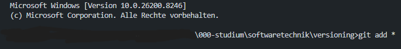
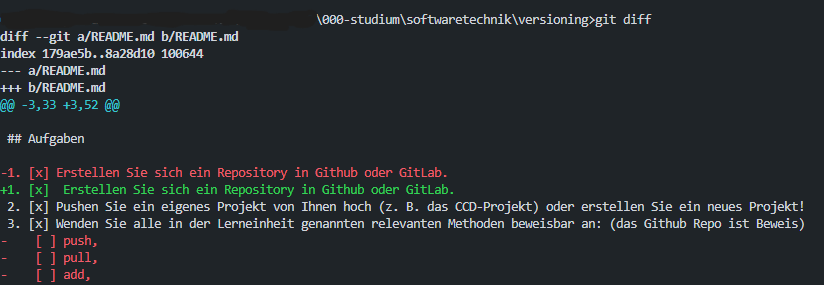
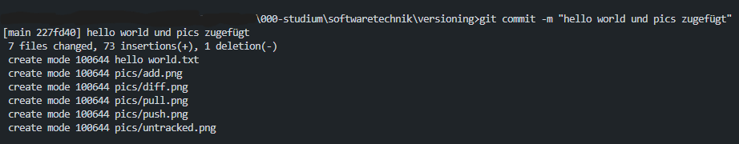
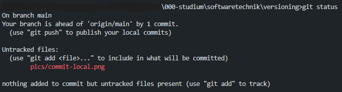
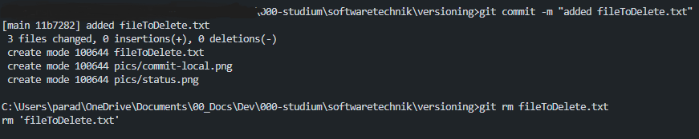
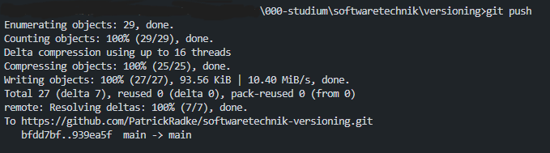

# softwaretechnik-versioning

## Aufgaben

1. [x]  Erstellen Sie sich ein Repository in Github oder GitLab.
2. [x] Pushen Sie ein eigenes Projekt von Ihnen hoch (z. B. das CCD-Projekt) oder erstellen Sie ein neues Projekt!
3. [x] Wenden Sie alle in der Lerneinheit genannten relevanten Methoden beweisbar an: (das Github Repo ist Beweis) 
        [x] push, 
        [x] pull, 
        [x] add, 
        [x] commit, 
        [x] diff, 
        [x] status, 
        [x] rm/mv, etc.
4. [ ] Experimentieren Sie mit Zeitreisen!
5. [ ] Erstellen Sie zwei unterschiedliche aber ähnliche Branches, wechseln Sie hin und her und mergen sie diese Branches dann wieder!
6. [ ] Erstellen Sie in GitHub einen Pull-Request bezugnehmend auf https://github.com/edlich/education! (was kleines, nützliches, witziges, etc., aber nicht via Shell, sondern via GitHub click!)

## 1. 
 
- repo softwaretechnik-versioning erstellt
- https://github.com/PatrickRadke/softwaretechnik-versioning

## 2.  

- neues Projekt erstellt

## 3.  

### add
- "hello world.txt" file im Projekt zugefügt -> anfangs untracked (U)

- nutze Befehl: 'git add *'
- file nun im Status "index added":

### diff

- nutze Befehl: 'git diff'
- Ergebnis:

### pull

- nutze Befehl: 'git pull'
- Ergebnis:

### commit

- nutze Befehl: 'git commit -m "hello world und pics zugefügt"'
- Ergebnis Projekt:

### status

- nutze Befehl: 'git status'
- Ergebnis:

### rm

- lege Datei an, die gelöscht werden soll: fileToDelete.txt
- adde und committe die Datei
- nutze Befehl: 'git rm fileToDelete.txt'
- Ergebnis:

### mv

- lege Datei an, die verschoben oder umbenannt werden soll: fileToMoveOrRename.txt
- adde und comitte die Datei
- nutze Befehl: 'git mv fileToMoveOrRename.txt file1.txt'
- Ergebnis:

(der Befehl gab keine weitere Bestätigung aber die Datei war danach umbenannt)

### push

- commite letzten aktuellen Stand
- nutze Befehl: 'git push'
- Ergebnis lokal:

- Ergebnis repo:

